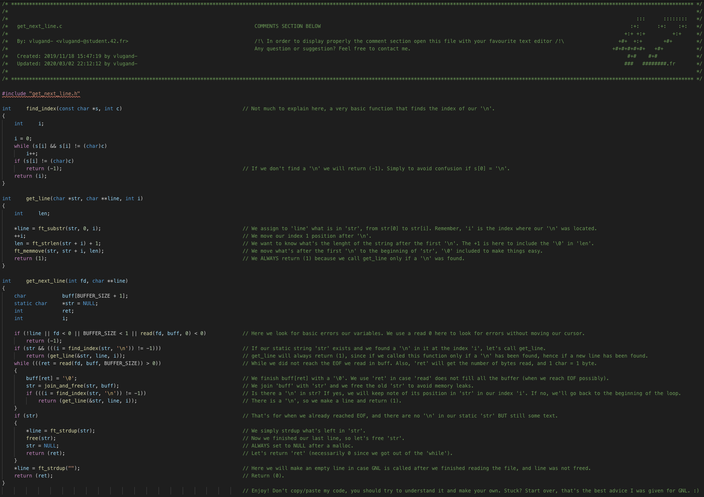

# Get Next Line (2019)

This [42](https://42.fr/en/homepage/) project aims to make us write a function that allows us to open and read a file line by line using file descriptors and store its content in a `char **` (string array).

## 🧭 Usage

Clone the repository and access it with `cd`. From there, use the following command :
```
make bonus
```

## 📚 Code explained in details




### Note for 42 students

Please don't copy/paste my code, you should try to understand it and make your own.

Stuck? Start over, that's the best advice I was given for GNL. :)

Good luck!
